# Self-Organized Critical Properties of Earthquakes through Cellular Automata-based Models
### Evan New-Schmidt, Matt Brucker

### Abstract

<<<<<<< HEAD
In the physical world, earthquakes have been found to follow a law known as the Gutenberg-Richter law[[2]](http://downloads.gphysics.net/papers/BakTang_1989.pdf): the number of earthquakes that occur follows a power-law distribution relative to the size of the earthquake. One potential explanation for this, initially proposed by Bak and Chen, is that the crust of the earth is in a self-organized critical state. They explore this possibility by modeling the earth's crust as a grid of sliding blocks, with each block sitting on a stationary plate and attached to a sliding plate as well as its neighbors with springs. Each block has a certain static friction force which, when overcome by the forces due to the springs, causes the block to slip and redistribute forces to its neighbors. In this paper, we replicate a similar model proposed by Olami, Feder, and Christensen[[1]](https://journals.aps.org/prl/pdf/10.1103/PhysRevLett.68.1244), which differs from Bak and Chen's model in that it's nonconservative; blocks have an elasticity coefficient that controls how much force is transfered when slipping occurs, and thus energy is lost from the system. We simulate this model and find that the system follows a power-law distribution over a range of values of elasticity coefficients, making it likely that it's a self-organized critical system. We further explore the other features of self-organized critical systems, pink noise and fractal geometry, to determine the robustness of the system's self-organized critical properties. We find that energy conservation isn't a requirement for self-organized criticality, as the system displays a number of self-organized critical traits across a range of elasticity coefficients.

### Power-Law Behavior of Earthquakes
Based on empirical data, Gutenberg and Richter[[2]](http://downloads.gphysics.net/papers/BakTang_1989.pdf) found that the number of earthquakes N above a certain size m that occur follows the distribution:
=======
In the physical world, earthquakes have been found to follow a law known as the Gutenberg-Richter law[[2]](http://downloads.gphysics.net/papers/BakTang_1989.pdf): the number of earthquakes that occur follows a power-law distribution relative to the size of the earthquake. One potential explanation for this, initially proposed by Bak and Chen, is that the crust of the earth is in a self-organized critical state. They explore this possibility by modeling the boundary of two plates of the earth's crust as a grid of sliding blocks, with each block sitting on a stationary plate and attached to a sliding plate as well as its neighbors with springs. Each block has a certain static friction force which, when overcome by the forces due to the springs, causes the block to slip and redistribute forces to its neighbors. In this paper, we replicate a similar model proposed by Olami, Feder, and Christensen[[1]](https://journals.aps.org/prl/pdf/10.1103/PhysRevLett.68.1244), which differs from Bak and Chen's model in that it's nonconservative; blocks have an elasticity coefficient that controls how much force is transfered when slipping occurs, and thus energy is lost from the system. We simulate this model and find that the system follows a power-law distribution over a range of values of elasticity coefficients, making it likely that it's a self-organized critical system. We further explore the other features of self-organized critical systems, pink noise and fractal geometry, to determine the robustness of the system's self-organized critical properties. We find that energy conservation isn't a requirement for self-organized criticality, as the system displays a number of self-organized critical traits across a range of elasticity coefficients.

### Power-Law Behavior of Earthquakes
Based on empirical data, Gutenberg and Richter[[2]](http://downloads.gphysics.net/papers/BakTang_1989.pdf) found that the number of earthquakes *N* above a certain size *m* that occur follows the distribution:
>>>>>>> 55a83fdb6359224952ef149816a124776d998666

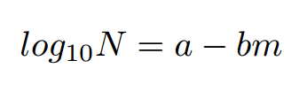

where *a* and *b* are constants that vary depending on the location of the earthquake. The exact cause of this phenomenon is unknown, but a possible explanation is that this occurs because of the geometry of fault lines; fault lines have been found to exhibit fracticality, which along with the power-law feature hints toward the potential that earthquakes exist in a self-organized critical state. Thus we can use a simplified model to help explain how this phenomenon occurs.

### A Cellular Automaton-based Model for Earthquakes

<<<<<<< HEAD
Olami, Feder, and Christensen[[1]](https://journals.aps.org/prl/pdf/10.1103/PhysRevLett.68.1244) propose a model for earthquakes based on cellular automata. The earthquake is represented as a grid of sliding blocks; each block sits on a stationary plate and is attached to a moving plate, as well as its neighbors, by springs. This system is represented by an NxN grid of cellular automata, where each cell represents a single block. The forces on each block are determined by the position of the block, the position of its neighbors, and the spring constants between everything:

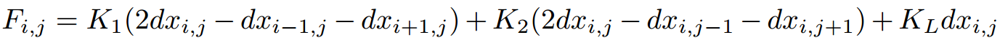

where *dx* is the offset of the block from the equilibrium position, *K1* is the spring constant of horizontal neighbors, *K2* is the spring constant of vertical neighbors, and *KL* is the spring constant connecting to the sliding plate. We limit the scope of our analysis to the isotropic case, where *K1 = K2.* Additionally, we assume that *F = 0* at the boundaries. When the sliding plate moves, the forces on each block increase proportionally to *KL*, until a block reaches the threshold force, *Fth,* and slips.

There are three phases to the earthquake model:
1. *Initialization:* We simplify the initialization of Olami et al.'s model by initializing each block to a random value of *dx* in the range [0, *Fth*], where *Fth* is defined as the same value for all blocks. Based on the values of *dx,* we then find the initial total force on each block. The total force on each block can be positive or negative, but a cell will slip once the absolute value of the force reaches *Fth* regardless of sign.
2. *Force Redistribution:* First, we find which cells have a total force on them greater than or equal to *Fth*. Then, for each block with force greater than *Fth,* we redistribute forces according to the following equation:

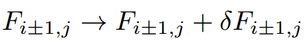  
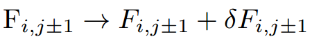  

where the force added to each neighbor is defined as:

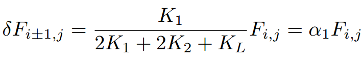  
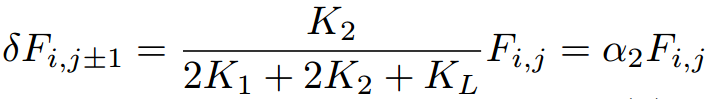

In our model, redistribution always increases the magnitude of forces on a blocks' neighbors, regardless of whether forces are positive or negative. The values of *a1* and *a2* are the elasticity coefficients, which give us an idea of how much energy is lost when a block redistributes its forces to its neighbors. Note that in this model, because we limit it to *K1 = K2,* then *a1 = a2 = a.* When *a = .25* the system is effectively conservative, as each block redistributes 25% of its force to each of its four neighbors, conserving energy (except at the edges).

This process of force redistribution is continued until enough energy has been lost such that no blocks are slipping.

3. *Global Perturbation:* Once all blocks have finished slipping, the earthquake is finished. Then, we perturb the system globally by finding the block with the highest strain and designating it *Fi*. Next we add *Fth - Fi* to all blocks in order to start a new earthquake, since at least one block is guaranteed to slip, and repeat step 2 again. Recall that in this model, the cause of the first block slipping is the moving of the sliding plate; this global perturbation effectively moves the simulation forward from the finish of one earthquake to the beginning of the next earthquake, caused by the movement of the plates.

The process of redistribution and perturbation can be see in Figure 1:

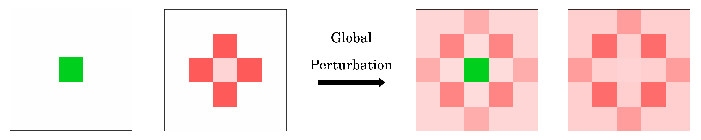
**Figure 1.** The first four timesteps of a simulation with *N*=5 and a single center block intialized to *F=4Fth*. Green indicates a sliding block.

In the first timestep, the center block slides; in the next timestep, none of the blocks slide, so the entire system is perturbed and the four blocks neighboring the center block slide. In the third timestep, the center block has gained enough force to slide again, leading to the end result in the fourth timestep.

### Earthquake Simulations

To investigate the SOC properties of this earthquake model, we simulate earthquakes over a number of iterations and values of parameters. Figure 1 shows the results of our simulation with N=35, over 100,000 iterations. Because the energy released in an earthquake is proportional to the number of blocks that slide, we use the total number of sliding blocks as our measure of earthquake energy, as did Olami et al.

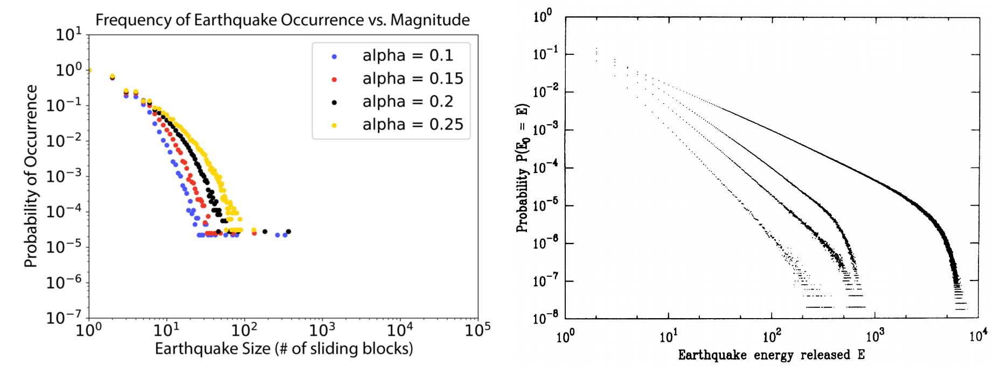

*Figure 1. The probability of an earthquake's occurrence as a function of its size (measured by the total number of blocks sliding.) Simulated over 100,000 iterations with N=35 and a = 0.1, 0.15, 0.2, and 0.25. Plotted on a log-log scale.*

On a log-log scale, the relation between earthquake size and probability of occurrence is fairly linear, in the body of the data. Additionally, as *a* decreases, the slope of the distribution gets more negative. This fits with the findings of Olami et al.: as can be seen in Figure 2, they also found this behavior, concluding that this distribution follows a power law. However, there are some qualitative differences between our graph and theirs; namely, ours bottoms out at a higher occurrence probability, and also has a lower maximum energy. This is because of the difference in the number of simulations: we ran 100,000 earthquakes for each simulation in order for things to remain computationally feasible, whereas the number of earthquakes simulated by Olami et al. is unknown, but at least 10^8 (since their smallest probability is 10^-8). Thus, our graph bottoms out sooner, and because there are fewer earthquakes happening, there is less opportunity to have large earthquakes, so they don't occur.

We take our exploration further by examining how this SOC behavior changes quantitatively with the elasticity coefficient. We have already shown quantitatively that the distribution of earthquake sizes follows a power-law under a range of elasticity coefficients; Figure 2 shows what this relationship looks like quantitatively.

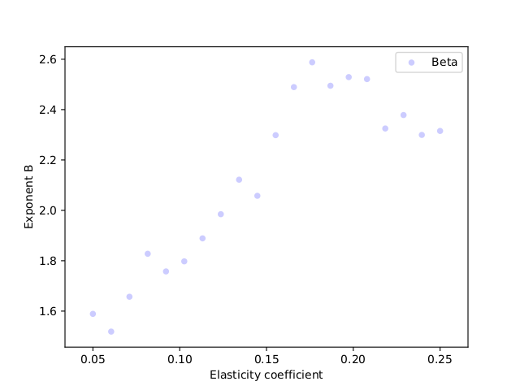

*Figure 2. The critical exponent B of the power-law distribution of earthquake sizes as a function of the elasticity coefficient a. Simulated with N=35 over 10,000 iterations.*

Our graph shows that the exponent on the power-law distribution of earthquake sizes increases with the elasticity coefficient, up until the point where *a = .2*, at which it drops off slightly. This is different from Olami et al., who found that the power-law exponent decreases as *a* increases. This difference is, again, likely caused by the fact that we ran our simulation for fewer iterations, which caused the exponent on the best-fit line to change due to the "bottoming out" values. However, regardless, our model still indicates that the system follows a power-law distribution, which can be seen quantitatively in Figure 2 and qualitatively in Figure 1.

### Exploring SOC Further: Pink Noise and Fractal Geometry

The distribution of earthquake sizes indicates that this earthquake model is self-organized critical; however, the other primary features of self-organized criticality, pink noise and fractal geometry, can be useful further tests of self-organized criticality.

#### Pink Noise

If we model the slipping of blocks over a series of timesteps as a time-domain signal, with the amplitude of the signal at each timestep equal to the amount of energy released that timestep, we can observe the power spectrum of the signal to determine whether the system exhibits pink noise. We run the simulation for 10,000 iterations and plot the results on a log-log scale in Figure 3.

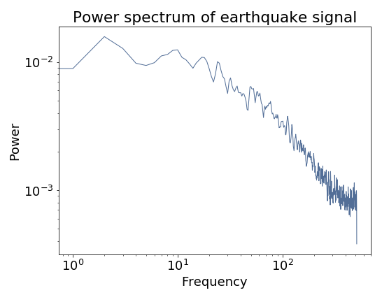

*Figure 3. The power of each frequency in the sliding-block signal, plotted on a log-log scale. Simulated over 10,000 iterations with N=35.*

The slope of this distribution on a log-log scale is -.74, which is fairly close to the standard slope of -1 for pink noise, so while this is somewhat indicative of SOC, it is not a conclusive indicator that the system is SOC.

#### Fractal Geometry
Finally, we examine whether the system is SOC by looking for fractal geometry in the patterns of the forces. To accomplish this, we run the simulation at a number of sizes ranging from *N=10* to *N=100*, and to create a box-counting dimension, we discretize the final grid of forces after the simulation has been run and counting the number of cells that fall into each "bin." Figure 4 shows the results of our simulations.

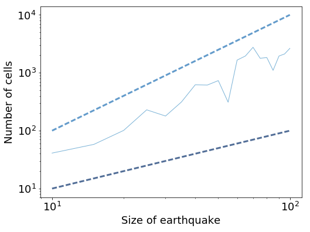

*Figure 4. The size of the box-counting dimension (which, in our system, we define as the number of cells falling within a certain range of forces) as a function of the size of system. Simulated over 1000 iterations each with sizes from N=10 to N=100.*

Our simulations resulted in a dimension with exponent 1.92, which is fairly close to quadratic. Thus, it is pretty unlikely that this system exhibits fractal geometry, at least in the dimension of the number of cells falling into each level of forces.

### Conclusions

Early simulations of this system point to it being self-organized critical: the distribution of earthquake sizes is fairly close to a power law, with an exponent that decreases as elasticity decreases, as Olami et al. found in their paper. Additionally, we found that the system displays this behavior across a range of different elasticity coefficients, even when the system is nonconservative. Our other tests also indicate some presence of self-organized critical qualities: the noise of the system is close to pink, which is indicative of self-organized criticality, although not exactly at the level of pink noise. Similarly, the system appears somewhat fractal - but again, not conclusively so. So, in answering the fundamental question of whether earthquake systems can be nonconservative and self-organized critical, we find that there is not enough evidence to say that nonconservative systems such as the earthquake model can be critical.

### Bibliography

[1] [Self-Organized Criticality in a Continuous, Nonconservative Cellular Automaton Modeling Earthquakes](https://journals.aps.org/prl/pdf/10.1103/PhysRevLett.68.1244)  
*Olami, Zeev; Hans Jacob S. Feder; and Kim Christensen.* Physical Review Letters, Vol. 68 Number 8.

Olami, Feder, and Christensen explore the applications of modeling earthquakes' occurrence through cellular automata, building on previous work that shows the power-law distribution of earthquakes. They model earthquakes through a sliding-block model consisting of two plates, one fixed and one moving, with a two-dimensional grid of blocks between them. The blocks are attached by springs to the moving plates, held by friction to the fixed plate, and attached to their neighboring blocks by springs. Each block has a maximum friction force, after which the block starts moving, reaching an equilibrium state and redistributing its force to its neighbors. They simulate this system, analyzing the probability of earthquakes occurring with a given energy, and examining the effect of varying the elasticity (i.e. how much force is distributed to other blocks when one block slides). They find that the system exhibits a power law distribution over a long range of energy conservation values, and even with the introduction of noise; they also find that the exponent of the power law distribution is dependent on the value of the elasticity parameter. They also find that the system has a state of metastability, where it's stable until it crosses a certain threshold. They believe this to be a fundamental property of modeling earthquakes.

[2] [Earthquakes as a Self-Organized Critical Phenomenon](http://downloads.gphysics.net/papers/BakTang_1989.pdf)  
*Bak, Per, and Chao Tang.* Journal of Geophysical Research, Vol. 94 Number B11. Published November 10, 1989.

In this paper, Bak and Tang propose a model to explain the distribution of earthquake energies as determined by empirical data. To answer this question, they build off of existing models that represent faults as a network of blocks connected by springs and connected to two plates, one fixed and one sliding. They represent this model through a cellular automata simulation, with each cell representing a single block. Random stresses are added to individual blocks each timestep; once a block reaches a critical level of stress, it slips and distributes its stress to its neighbors. After a certain amount of total stress has been added to the system, it reaches a critical state in which stresses may trigger any size of earthquake, only bounded by the size of the model. From this model, they find that the magnitudes of earthquakes follow a power-law distribution in this state. Their model builds on previous models of earthquakes, but it adds the critical step of observing the power-law distribution of earthquake magnitudes. They conclude that their model may be an explanation of how this power-law distribution came to be in earthquakes in the natural world.

[3] [Unified Scaling Law for Earthquakes](https://arxiv.org/pdf/cond-mat/0112342.pdf)
P Bak, K Christensen, L Danon, T Scanlon - Physical Review Letters, 2002 - APS

Bak et al. look at earthquake data in California, specifically waiting times and estimate their fractal dimension. They find that there is no meaningful difference between aftershocks and main shocks, and a power-law correlation between waiting times and magnitude. Plotting recorded earthquake epicenters on a 2-dimensional map, they find that grouping earthquakes by magnitude yields a fractal dimension of 1.2. They frame earthquakes as processes that produce sequences of correlated earthquakes, similar to SOC avalanche models. This framing is similar to the models proposed in Zeev et al. and Bal et al., and offers potential methods of observing fractal dimension in those models to compare with actual earthquake data.
