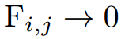
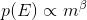

<!-- >>> Power law (0.1, 0.15, 0.2, 0.25): 2.6, 2.3, 2.25, 1.7
>>> Pink noise: a = -1.07
>>> Fractal geometry: (dim1, dim2, dim3, dim4): 2.05, 1.97, 0.01, nan

>>> Pink noise, alpha = 10: non-linear
>>> Pink noise, alpha = .25: -1.76
>>> Fractals, alpha = .1: 1.99, 2.01
>>> Fractals, alpha = .25: 1.90, 2.04 -->

# Self-Organized Critical Properties of Earthquakes through Cellular Automata-based Models
### Evan New-Schmidt, Matt Brucker

### Abstract

In the physical world, earthquakes follow an empirically-determined law known as the Gutenberg-Richter law[[2]](http://downloads.gphysics.net/papers/BakTang_1989.pdf): the number of earthquakes that occur follow a power-law distribution relative to the size of the earthquake. One potential explanation for this, initially proposed by Bak and Chen, is that the crust of the earth is in a self-organized critical (SOC) state. They explore this possibility by modeling a fault line in the earth's crust as a grid of sliding blocks, with each block sitting on a stationary plate and attached by springs to a sliding plate as well as its neighbors. Each block has a static friction force which, when overcome by the total spring force, causes the block to slip, thereby redistributing its force to its neighbors. In this paper, we replicate a similar model proposed by Olami, Feder, and Christensen[[1]](https://journals.aps.org/prl/pdf/10.1103/PhysRevLett.68.1244), which differs from Bak and Chen's model in that it is non-conservative: blocks have an elasticity coefficient that controls how much force is transferred when slipping occurs, and thus energy is lost from the system. This is important because previous model such as Bak and Chen's assume energy conservation to be necessary for SOC; however, earthquakes in the real world are not conservative, and as such, under Bak and Chen's definition they lack the elements necessary to be SOC. We replicate Olami et al.'s model in order to determine whether it follows a power-law distribution even under non-conservative conditions, in order to determine whether non-conservative systems can be SOC, and thus whether earthquakes in the natural world are SOC. We find results consistent with theirs: the sizes of earthquakes follow a power-law distribution over a range of values of elasticity coefficients, suggesting that this model may be SOC. In order to more thoroughly define whether it is SOC, We investigate the other common features of SOC systems - pink noise and fractal geometry - to determine the robustness of the system's SOC properties. We find that this system does exhibit SOC behavior to some degree, particularly in its power-law distribution and in its pink noise; however, we do not find any fracticality in the system at any level of energy conservation. Still, this model exhibits SOC behavior when non-conservative, which is important for defining real-world earthquakes

### Power-Law Behavior of Earthquakes
Based on empirical data, Gutenberg and Richter[[2]](http://downloads.gphysics.net/papers/BakTang_1989.pdf) find that the number of earthquakes N above a certain size m that occur follows the distribution:

 </img>

where a and b are constants that vary depending on the location of the earthquake. The exact cause of this phenomenon is unknown, but because power-law distributions are a common feature of SOC systems; additionally, the fault lines of earthquakes have also been found to exhibit fracticality[[2]](http://downloads.gphysics.net/papers/BakTang_1989.pdf), which also indicates that earthquakes potentially exist in a self-organized critical state. Thus, we can explain these properties of earthquakes through simplified SOC models. However, Olami et al. take a different approach to SOC models; they explore SOC in a system that is not conservative, whereas energy conservation is typically assumed to be a requirement for SOC systems[[2]](http://downloads.gphysics.net/papers/BakTang_1989.pdf). Exploring how the level of conservation affects the SOC behavior of the system can help explain under what conditions the system is SOC, which is relevant to real-world systems like earthquakes that are non-conservative.

### A Cellular Automaton-based Model for Earthquakes

Olami, et al.[[1]](https://journals.aps.org/prl/pdf/10.1103/PhysRevLett.68.1244) propose a model for earthquakes based on cellular automata. As shown in Figure 1, an earthquake is represented as a grid of sliding blocks; each block sits on a stationary plate and is attached by springs to a moving plate as well as its neighbors.

 </img>

_**Figure 1: A visualization of the block-spring model of earthquakes. Each block sits on a stationary plate, and is connected to both its neighbors and a moving plate by springs.**_

 Olami et al. represent this system computationally with an NxN grid of cellular automata, where each cell represents a single block. The forces on each block are determined by the position of the block, the position of its neighbors, and the spring constants between neighbors and the sliding plate:

 

  </img>
 

where dx is the offset of the block from the equilibrium position, K1 is the spring constant of horizontal neighbors, K2 is the spring constant of vertical neighbors, and KL is the spring constant connecting to the sliding plate. Olami et al. limit the scope of their analysis to the isotropic case, where K1 = K2; thus, when a block slips, it redistributes its total force equally to its horizontal and vertical neighbors. Additionally, we assume that F = 0 at the boundaries. When the sliding plate moves, the forces on each block increase proportionally to KL, until a block reaches the threshold force, Fth, and slips.
There are three phases to the earthquake model:

1. *Initialization:* In their model, Olami et al. initialize each block to a random value of dx in the range [0, Fth], where Fth is a universal value for all blocks. Based on the values of dx, we then find the initial total force on each block. The total force on each block can be positive or negative, but a cell will slip once the absolute value of the force reaches Fth regardless of sign.

2. *Force Redistribution:* First, Olami et al. find which cells have a total force on them greater than or equal to Fth. Then, for each block with force greater than Fth, they redistribute forces according to the following equations:

 </img>

  

 </img>

 </img>

  where the force added to each neighbor is defined as:

  

   </img>
  
  
  

   </img>
  

  In this model, the values of α1 and α2 are the *elasticity coefficients*, which control what percentage of force is distributed from a sliding block to each of its neighbors, giving us an idea of how much force is lost (and thus how much energy is lost) when a block slides. Note that in this model, because we limit our exploration to the case K1 = K2, then α1 = α2 = α. When α = .25 the system is effectively conservative, as each block redistributes 25% of its force to each of its four neighbors, conserving energy (except at the edges).

  This process of force redistribution is continued until enough energy has been lost such that no blocks are slipping.

3. *Global Perturbation:* Once all blocks have finished slipping, the earthquake is finished. Then, we perturb the system globally by finding the block with the highest strain, designating it Fi, and adding Fth - Fi to all blocks - this guarantees that at least one block will slip, effectively starting a new earthquake; then, we go back to the force redistribution phase and start again. Recall that in this model, the cause of the first block slipping is the moving of the sliding plate; this global perturbation serves to simulate this effect; since KL is the same for all blocks, we can achieve the same outcome as the plate moving by simply adding the same force to all blocks.

The process of redistribution and perturbation can be see in Figure 2:

_**Figure 2.** The first four timesteps of a simulation with N = 5 and a single center block initialized to F = 4Fth. Green indicates a sliding block._

In the first timestep, the center block slides; in the next timestep, none of the blocks slide, so the entire system is perturbed and the four blocks neighboring the center block slide. In the third timestep, the center block has gained enough force to slide again, leading to the end result in the fourth timestep.

### Earthquake Simulations

To replicate the work of Olami et al. and investigate the SOC properties of this earthquake model, we simulate this process of earthquake formation across varying parameters, in particular α. Figure 3 shows the results of our simulation at different values of α. We use the total number of sliding blocks as our measure of energy, as do Olami et al., since it is proportional to the amount of energy released by the earthquake.

_**Figure 3.** The probability of an earthquake's occurrence as a function of its size (measured by the total number of blocks sliding.) Simulated over 100,000 iterations with N = 35 and α = 0.1, 0.15, 0.2, and 0.25. Plotted on a log-log scale._

Focusing on the body of the data, the relation between earthquake size and probability of occurrence is fairly linear on a log-log scale. Additionally, as α increases, the slope of the distribution gets less negative. Our data quantitatively matches Olami et al.: as can be seen in Figure 3, they also observe distributions that appeared to be power-law, with slope becoming less negative as α increases. In order to closer investigate whether this distribution follows a power law, we also plot the CDF of the earthquake probabilities:

 </img>

_**Figure 4.** The CDF of the probability of an earthquake's occurrence vs. its size. Simulated over 100,000 iterations with N = 35 and α = 0.1, 0.15, 0.2, and 0.25. Plotted on a log-x scale._

As shown in Figure 4, on a log-x scale, the body of the distribution is fairly straight; additionally, the distribution follows a similar shape across all values of α. Thus, the power-law shape of the CDF appears to be consistent with our results from the log-log PMF plot, indicating that the system follows a power-law distribution.

The only difference in the distribution of our data compared to Olami et al.'s is in the tail behavior; the minimum probability of occurrence we found is 10-6, whereas theirs is approximately 10-8. This difference is due to the number of simulation iterations - we ran the simulation for 106 iterations, making 10-6 the absolute minimum probability, whereas Olami et al. ran their simulation over approximately 108 iterations, lowering the minimum probability. However, this difference only affects the tail of the distribution, which deviates from the straight-line behavior anyway, so we focus only on the body of the data when looking for power-law behavior.

### Examining SOC and Elasticity Coefficients

Olami et al. take their exploration further by examining how this SOC behavior changes quantitatively with the elasticity coefficient. We have already shown qualitatively that the distribution of earthquake sizes follows a power-law under a range of elasticity coefficients. If the distribution of earthquake sizes E is follows a power-law distribution with size m, the distribution of sizes approximately follows:

 </img>

Thus, the slope of the distribution on a log-log scale gives us the exponent β. Olami et al. find β across different values of α by performing the same simulations as earlier, seen in Figure 5:

 </img>

_**Figure 5.** The critical exponent β of the power-law distribution of earthquake sizes vs. the elasticity coefficient α. Simulated with N = 35 over 100,000 iterations for each value of α._

Our graph shows that β decreases with the elasticity coefficient, up until the point where α = .2, at which it increases slightly before dropping to ~1.7 when α = .25. This is different from Olami et al., who find that the power-law exponent decreases consistently with α. This difference is likely due to the fact that we ran our simulation for fewer iterations (106), which results in different tail behavior (as seen in Figure 3), and thus a different value for β since we find β based on the slope of the log-log distribution. However, Figure 3 and Figure 4 demonstrate that our model follows a power-law distribution fairly closely, and our model still has behavior that qualitatively resembles the behavior seen by Olami et al. This points toward the system being SOC, but there are more aspects of SOC we can investigate in order to get a more comprehensive picture of how the system behaves.

### Exploring SOC Further: Pink Noise and Fractal Geometry

This system's distribution of earthquake sizes suggests that this earthquake model may be self-organized critical under a range of values of α. However, power-law behavior is just one element of SOC systems; we develop a more thorough picture of this system's SOC features by investigating the other two defining properties of SOC systems, pink noise and fractal geometry.

#### Pink Noise

If we model the earthquake over a series of timesteps as a time-domain signal, with the amplitude of the signal at each timestep equal to the number of blocks that slip, we can convert the signal to the frequency domain and observe the power spectrum of the signal to determine whether the system exhibits pink noise. We run the simulation for 100,000 iterations and plot the results in Figure 6.

 </img>

_**Figure 6.** The power of each frequency in the sliding-block signal, plotted on a log-log scale. Simulated over 10,000 iterations with N = 35, and α = 0.2._

The body of the data is fairly linear; however, the distribution is flatter at low frequencies and curves upward at high frequencies. The slope of this distribution on a log-log scale is -1.07, which is close to the standard slope of -1 for pink noise. This indicates that the system is SOC; the upward curve at high frequencies is likely due to noise, since power is low enough that small variations could cause a noticeable upward curve as in our data.

Additionally, we examine how this power spectrum is affected by the level of energy conservation. Figures 7 and 8 show the power spectrum at α = .1 and α = .25, respectively.

 </img>

_**Figure 7.** The power of each frequency in the sliding-block signal, plotted on a log-log scale. Simulated over 10,000 iterations with N = 35, and α = 0.1._

 </img>

_**Figure 8.** The power of each frequency in the sliding-block signal, plotted on a log-log scale. Simulated over 10,000 iterations with N = 35, and α = 0.25._

At α = .1, the power spectrum is less linear on a log-log scale: there is a large jump at high frequencies. At α = .25, the spectrum is closer to linear, but with a slope of -1.71, it is not very close to being pink noise. Thus, the pink noise property of the system does not appear to be consistent across different values of α.

#### Fractal Geometry
The last factor we investigate to determine the system's SOC properties is fractal geometry. Finding fractal geometry requires a box-counting dimension; for our system, we choose the total force on each block as the box-counting dimension, as it is a quantitative value that can be measured across different values of N. However, because the forces on each block are non-discrete values, we must first convert them into discrete values by placing them into different "dimensions," where each dimension contains the forces that fall within a certain range. In our model, we sort the forces on blocks into three dimensions, one with forces in the range [0, Fth/3], one with forces in range [Fth/3, 2Fth/3], etc. Then, we run the simulation for a high number of iterations and wait for the earthquake to settle, and count the number of blocks that fall within each range.

 </img>

_**Figure 7.** The size of the box-counting dimension as a function of the size of system. Simulated from N = 10 to N = 100 over 20,000 iterations for each size, and plotted on a log-log scale._

Our simulations only resulted with blocks in the first two dimensions, likely because the forces on the blocks have to be well under Fth for the earthquake to settle. Figure 7 shows the results of our simulations within the first two dimensions. On a log-log scale, the slope of each distribution is 2.05 and 1.97, respectively, which is essentially quadratic. Thus, it is pretty unlikely that this system exhibits fractal geometry, at least in the box-counting dimension we use. Additionally, changing α does not noticeably affect the fracticality of the system; at α = 0.1, the dimensions are 1.99 and 2.01, and at α = 0.25 the dimensions are 1.9 and 2.04. So with this box counting dimension, there does not appear to be a value of α that gives the system fracticality.

### Conclusions

Based on our replication of Olami et al., the sizes of earthquakes in our model appear to follow a power-law distribution; additionally, we find that this behavior is consistent across a range of different elasticity coefficients, including when the system is non-conservative. This indicates that energy conservation is not a requirement for SOC systems, at least when a global perturbation force is present. Looking beyond power-law distributions, we found a less clear picture of the system's SOC properties: exploring the "noise" of the system by representing the sliding of blocks as a discrete signal, we find that the system has a power spectrum close to pink noise (albeit with slight deviations) indicating that the system is SOC; however, the pink noise property does not hold under different amounts of energy conservation. Additionally, there is likely no fracticality present in our system, among any values of the elasticity coefficient - at least with the box-counting dimension we use, which means that there may be another dimension that could be used to find fracticality. Still, a power-law distribution is the phenomenon observed in real-world earthquakes, and our model follows it, even when non-conservative. Thus, it is possible that earthquakes in the real world are SOC despite being non-conservative.

### Bibliography

[1] [Self-Organized Criticality in a Continuous, non-conservative Cellular Automaton Modeling Earthquakes](https://journals.aps.org/prl/pdf/10.1103/PhysRevLett.68.1244)
*Olami, Zeev; Hans Jacob S. Feder; and Kim Christensen.* Physical Review Letters, Vol. 68 Number 8.

Olami, Feder, and Christensen explore the applications of modeling earthquakes' occurrence through cellular automata, building on previous work that shows the power-law distribution of earthquakes. They model earthquakes through a sliding-block model consisting of two plates, one fixed and one moving, with a two-dimensional grid of blocks between them. The blocks are attached by springs to the moving plates, held by friction to the fixed plate, and attached to their neighboring blocks by springs. Each block has a maximum friction force, after which the block starts moving, reaching an equilibrium state and redistributing its force to its neighbors. They simulate this system, analyzing the probability of earthquakes occurring with a given energy, and examining the effect of varying the elasticity (i.e. how much force is distributed to other blocks when one block slides). They find that the system exhibits a power law distribution over a long range of energy conservation values, and even with the introduction of noise; they also find that the exponent of the power law distribution is dependent on the value of the elasticity parameter. They also find that the system has a state of metastability, where it's stable until it crosses a certain threshold. They believe this to be a fundamental property of modeling earthquakes.

[2] [Earthquakes as a Self-Organized Critical Phenomenon](http://downloads.gphysics.net/papers/BakTang_1989.pdf)
*Bak, Per, and Chao Tang.* Journal of Geophysical Research, Vol. 94 Number B11. Published November 10, 1989.

In this paper, Bak and Tang propose a model to explain the distribution of earthquake energies as determined by empirical data. To answer this question, they build off of existing models that represent faults as a network of blocks connected by springs and connected to two plates, one fixed and one sliding. They represent this model through a cellular automata simulation, with each cell representing a single block. Random stresses are added to individual blocks each timestep; once a block reaches a critical level of stress, it slips and distributes its stress to its neighbors. After a certain amount of total stress has been added to the system, it reaches a critical state in which stresses may trigger any size of earthquake, only bounded by the size of the model. From this model, they find that the magnitudes of earthquakes follow a power-law distribution in this state. Their model builds on previous models of earthquakes, but it adds the critical step of observing the power-law distribution of earthquake magnitudes. They conclude that their model may be an explanation of how this power-law distribution came to be in earthquakes in the natural world.

[3] [Unified Scaling Law for Earthquakes](https://arxiv.org/pdf/cond-mat/0112342.pdf)
P Bak, K Christensen, L Danon, T Scanlon - Physical Review Letters, 2002 - APS

Bak et al. look at earthquake data in California, specifically waiting times and estimate their fractal dimension. They find that there is no meaningful difference between aftershocks and main shocks, and a power-law correlation between waiting times and magnitude. Plotting recorded earthquake epicenters on a 2-dimensional map, they find that grouping earthquakes by magnitude yields a fractal dimension of 1.2. They frame earthquakes as processes that produce sequences of correlated earthquakes, similar to SOC avalanche models. This framing is similar to the models proposed in Zeev et al. and Bal et al., and offers potential methods of observing fractal dimension in those models to compare with actual earthquake data.
