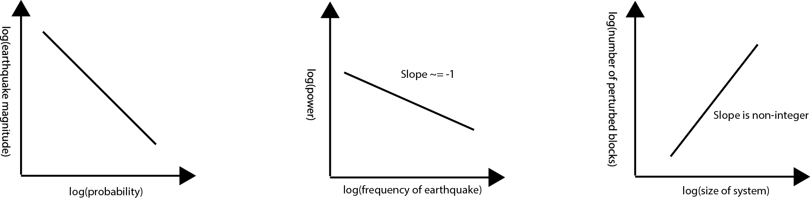

## Finding Properties of Self-Organized Criticality in Cellular Automata Earthquake Models
### Evan Lloyd New-Schmidt and Matt Brucker

### Abstract

In this paper, we intend to explore whether earthquakes, as modeled by cellular automata, exhibit the properties of self-organized criticality (SOC), and under what conditions they exhibit these properties. To this end, we will replicate the experiment conducted by Olami, Feder, and Christensen [1]. They build a model of earthquakes using a sliding block model consisting of a 2D grid of blocks sitting on a fixed plane and attached via springs to a moving plane; each block is connected to its neighboring blocks with more springs. Once the force on a block due to the movement of the plate exceeds the force of static friction on the block, it will come loose and move, distributing its force to its neighbors. With enough force on a block, a chain reaction can occur, causing a fully formed earthquake. They find that the earthquakes in their simulation exhibit a power-law distribution, with an interesting property: the exponent of the power-law distribution depends on the elasticicity parameter, which is a parameter that controls the conservation of energy when a block slides. We intend to replicate their experiment, and further investigate several properties. First, we will see whether the system exhibits SOC properties beyond just power-law distributions, which is the only property observed in the paper - i.e, we will explore whether they exhibit fractal geometry and pink noise. Second, we will investigate how the distribution of forces on each block affects the system; in Olami et al., the initial forces are randomly distributed. We will create "fault lines," clusters of blocks that begin with a high initial force on them, and explore how these clusters affect the behavior of the system as well as its SOC properties.

### Bibliography

[1] [Self-Organized Criticality in a Continuous, Nonconservative Cellular Automaton Modeling Earthquakes](https://journals.aps.org/prl/pdf/10.1103/PhysRevLett.68.1244)  
*Olami, Zeev; Hans Jacob S. Feder; and Kim Christensen.* Physical Review Letters, Vol. 68 Number 8.

Olami, Feder, and Christensen explore the applications of modeling earthquakes' occurrence through cellular automata, building on previous work that shows the power-law distribution of earthquakes. They model earthquakes through a sliding-block model consisting of two plates, one fixed and one moving, with a two-dimensional grid of blocks between them. The blocks are attached by springs to the moving plates, held by friction to the fixed plate, and attached to their neighboring blocks by springs. Each block has a maximum friction force, after which the block starts moving, reaching an equilibrium state and redistributing its force to its neighbors. They simulate this system, analyzing the probability of earthquakes occurring with a given energy, and examining the effect of varying the elasticity (i.e. how much force is distributed to other blocks when one block slides). They find that the system exhibits a power law distribution over a long range of energy conservation values, and even with the introduction of noise; they also find that the exponent of the power law distribution is dependent on the value of the elasticity parameter. They also find that the system has a state of metastability, where it's stable until it crosses a certain threshold. They believe this to be a fundamental property of modeling earthquakes.

[2] [Earthquakes as a Self-Organized Critical Phenomenon](http://downloads.gphysics.net/papers/BakTang_1989.pdf)  
*Bak, Per, and Chao Tang.* Journal of Geophysical Research, Vol. 94 Number B11. Published November 10, 1989.

In this paper, Bak and Tang propose a model to explain the distribution of earthquake energies as determined by empirical data. To answer this question, they build off of existing models that represent faults as a network of blocks connected by springs and connected to two plates, one fixed and one sliding. They represent this model through a cellular automata simulation, with each cell representing a single block. Random stresses are added to individual blocks each timestep; once a block reaches a critical level of stress, it slips and distributes its stress to its neighbors. After a certain amount of total stress has been added to the system, it reaches a critical state in which stresses may trigger any size of earthquake, only bounded by the size of the model. From this model, they find that the magnitudes of earthquakes follow a power-law distribution in this state. Their model builds on previous models of earthquakes, but it adds the critical step of observing the power-law distribution of earthquake magnitudes. They conclude that their model may be an explanation of how this power-law distribution came to be in earthquakes in the natural world.

[3] Unified Scaling Law for Earthquakes

P Bak, K Christensen, L Danon, T Scanlon - Physical Review Letters, 2002 - APS
Bak et al. look at earthquake data in California, specifically waiting times and estimate their fractal dimension. They find that there is no meaningful difference between aftershocks and main shocks, and a power-law correlation between waiting times and magnitude. Plotting recorded earthquake epicenters on a 2-dimensional map, they find that grouping earthquakes by magnitude yields a fractal dimension of 1.2. They frame earthquakes as processes that produce sequences of correlated earthquakes, similar to SOC avalanche models. This framing is similar to the models proposed in Zeev et al. and Bal et al., and offers potential methods of observing fractal dimension in those models to compare with actual earthquake data.

### Experimental Design
The main experiment we plan to replicate is Olami, Feder, and Christensen's earthquake experiment - we will create the cellular automata, run the simulation for various values of the elasticity parameter, and plot the probability distribution of the earthquake magnitudes as in the original paper. From that point, we have two extensions planned. Firstly, we plan to investigate whether the system exhibits the other SOC properties of earthquakes: pink noise and fractal geometry. To accomplish this, we will run the same simulation and compute the different metrics based on frequency of earthquakes and geometry of earthquakes. After that, we will modify the earthquake model so that the initial forces are clustered around certain areas that represent "fault lines;" after simulating this, we will investigate the model exhibits SOC properties as in the original experiment.

### Potential Results

The main interpretation we'll do is of the three critical graphs. The first graph is the distribution of earthquake magnitudes on a log-log scale (this is the graph that was included in the original paper); if the slope of this graph on a log-log scale is approximately a line, then we say taht the magnitudes of earthquakes follow a power-law distribution. They may also follow a similar heavy-tailed distribution such as a log-normal distribution. The next graph is the power of frequency of "relaxations" (i.e. the occurrences of blocks sliding); on a log-log scale, this should have a slope of approximately -1, in which case we interpret it as being pink noise. Finally, we will look at the number of "perturbed" (i.e. not in their equilibrium position) blocks as a function of the size of the system - on a log-log scale, if the slope of the line isn't an integer, we interpret the system as having fractal geometry.

The main area for concern in our project is in our extensions. As far as the implementation of the original paper goes, it has a fairly clear-cut question it's answering and there's enough documentation of the process to replicate it; however, for our replications, we are unsure of what to use as our metric for observing pink noise and fractal geometry. This is because this simulation doesn't have "states"  in the same way as other CA-based models, which will make finding some dimension for fractal geometry difficult. We have a few ideas for what to look at for fractal geometry though, such as the force on each block once the system returns to equilibrium. There is some indication in Bak and Tang [2] that earthquakes follow fractal geometry, so we should be able to find it somewhere. Our other extension, however, should allow us to answer useful questions about the world, as we're attempting to map this model more closely to the real world.

### Next Steps

Our immediate first steps are to implement the original earthquake model. We plan to implement the model by breaking it into separate chunks for implementing the model and for running the model, displaying neat things, and computing statistics of interest.

**Matt:** My immediate next steps are to write the class to visualize the model and compute the statistics we care about. The statistic computing should be implementable very quickly, although writing a useful visualization might take somewhat longer.

**Evan:** My next steps are to write the implementation of the earthquake model. We plan to implement it by extending Cell2D, which should make implementation fairly simple.
